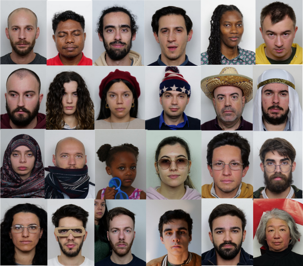
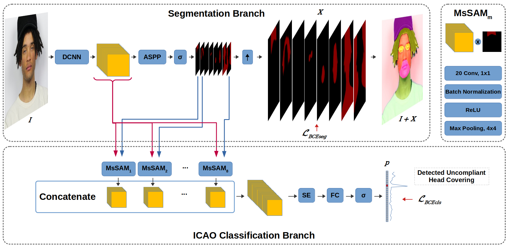

# DFIC: Towards a balanced facial image dataset for automatic ICAO compliance verification

The DFIC dataset is a novel comprehensive facial image dataset comprising around 58,000 annotated images and 2706 videos of more than 1000 subjects, that cover a broad range of non-compliant conditions, in addition to compliant portraits, facilitating the development of automated ICAO compliance verification methods.



## Environment Setup

0. Pre-notice: the code present in this repository was tested on Ubuntu 20.04.4 using python version 3.9.21.

1. Create virtual environment and activate it:
```bash
cd <YOUR_PROJECT_DIRECTORY>
python3 -m venv dfic_venv
source dfic_venv/bin/activate
```

2. Install dependencies:
```bash
pip install -r requirements.txt
```

## Dataset Request
To request the Dataset, please fill the following form:
https://forms.gle/pLfb6eRAmfbgNNVU9

Please notice that:
* The DFIC dataset is available for **non-commercial research purposes** only.
* You agree **not to** reproduce, duplicate, copy, sell, trade, resell or exploit for any commercial purposes, any portion of the images and any portion of derived data.
* You agree **not to** further copy, publish or distribute any portion of the DFIC dataset. Except, for internal use at a single site within the same organization it is allowed to make copies of the dataset.
* You agree to allow that an individual present in the dataset may exercise its rights under the GDPR, including access to personal data concerning the same, rectification or erasure, or restriction of processing, and the right to object to processing.


## DFIC ICAO Method:

The method present in this repository was used to validate the DFIC dataset and corresponds to the method presented in the associated paper.



### Models Download

Use the following link to download the trained models on DFIC: https://drive.google.com/drive/folders/1l6OAiyM0k93KJQ7G6ORzoX4oryrifYUc?usp=sharing

These models must be placed inside the method/models/ directory.


### Image ICAO Compliance Inference

To perform ICAO compliance evaluation on a single image, run the following command:

```
python inference.py --image_path PATH/TO/THE/IMAGE.jpg
```

To perform ICAO evaluation on multiple images, run the following command:
```
python inference.py --image_list_path PATH/TO/THE/IMAGE_LIST.txt --output_csv_path PATH/TO/RESULTS/OUTPUT_FILE.csv
```

where IMAGE_LIST.txt is a text file with one image path per line, and OUTPUT_FILE.csv is the destination file to save the results. If --output_csv_path is not defined, the results will be stored in the project root directory within inference_out.csv.

### Image ICAO Compliance training/testing scripts

In order to properly use the provided scripts, you must place the downloaded and extracted dataset in the data/DFIC/ directory. The file structure inside this directory should follow the structure defined in this [file](data/DFIC/README.md).

#### Training on DFIC

```
cd method
python train_procedure.py
```

#### Testing on DFIC
```
cd method
python evaluate_model_DFIC.py
```

## License and Citation
The trained models available in this repository are derived from the DFIC dataset, which is licensed for non-commercial use only. Therefore, the trained models, are RESTRICTED to **non-commercial research and educational purposes** under the [license](LICENSE.md). If you use our codebase, method, models or dataset, please cite our work:
```
@misc{gonçalves2026dficbalancedfacialimage,
      title={DFIC: Towards a balanced facial image dataset for automatic ICAO compliance verification}, 
      author={Nuno Gonçalves and Diogo Nunes and Carla Guerra and João Marcos},
      year={2026},
      eprint={2602.10985},
      archivePrefix={arXiv},
      primaryClass={cs.CV},
      url={https://arxiv.org/abs/2602.10985}, 
}
```
